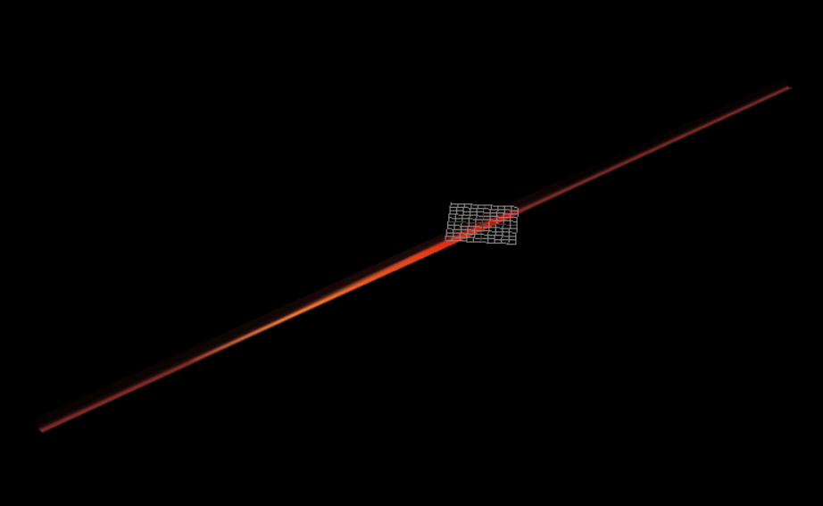
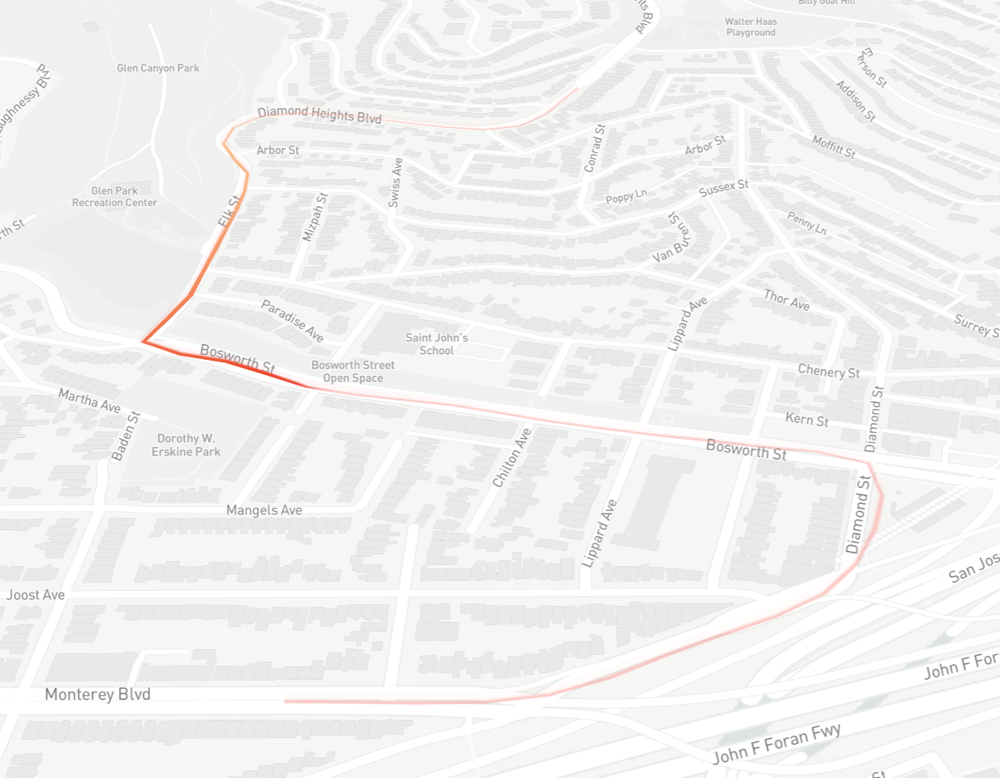

## 中文版：
问题：

流动效果在移动地图的时候有抖动

描述：

我用threejs实现了一个流动效果:

这里是[threejs代码](./threejs.html)。

用相同的方法在threebox中实现相同的效果：

这里是[threebox代码](./threebox.html)，但是它在移动地图的时候有抖动现象：

请问这是为什么，有没有其他更好的实现方式。

## 英文版：
Question: 

Flow effects have jitter when moving the map

Description：

I implemented a flow effect using threejs:

[threejs code](./threejs.html), [preview](http://arthas.com.cn/line-example/threejs.html)

Use the same method to achieve the same effect in threebox:

Here`s [threebox code](./threebox.html), [preview](http://arthas.com.cn/line-example/threebox.html),
but it has a jiggle when moving the map:

Why is that? Is there a better way to do it?

thanks!

